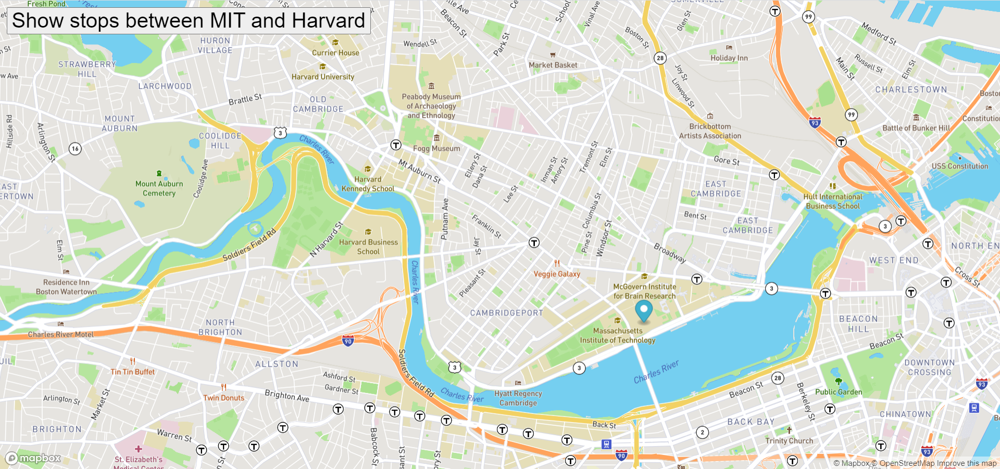

# Bus Tracker
 

# https://lucaza21.github.io/Eyes/

## Description: 
The real time bus tracker web page uses the convination of HTML, JS and CSS  and the library MatBox to create a traceroute from point A to point B.
Here you will be able to import the mapbox library to show a map in the screen and use a marker to step forward some bus stops between MIt and Harvard campus.

## Usage: 
It helps to understand how to use public tokens to import built in APIs and work with them.
After download the repo, please open the index.htlm file and click on the button "Show stops betwwen MIT and Harvard". the marker will start to move from MIT campus to Harcard campus showing the bus stops between them.

for using this repo you must create an account in mapbox.com and get your token key.

## Support:
Email: <luis.carrasquilla.z@gmail.com> / 
Linkedin: **[Luis Carrasquilla](https://www.linkedin.com/in/luis-carrasquilla/)** 

## Roadmap
I'm planning to create routes between 2 points and display walk, car and bycicle roads.

## License information:  
This project has been made in the MIT xPRO's Professional Certificate in Coding: Full Stack Development with MERN

